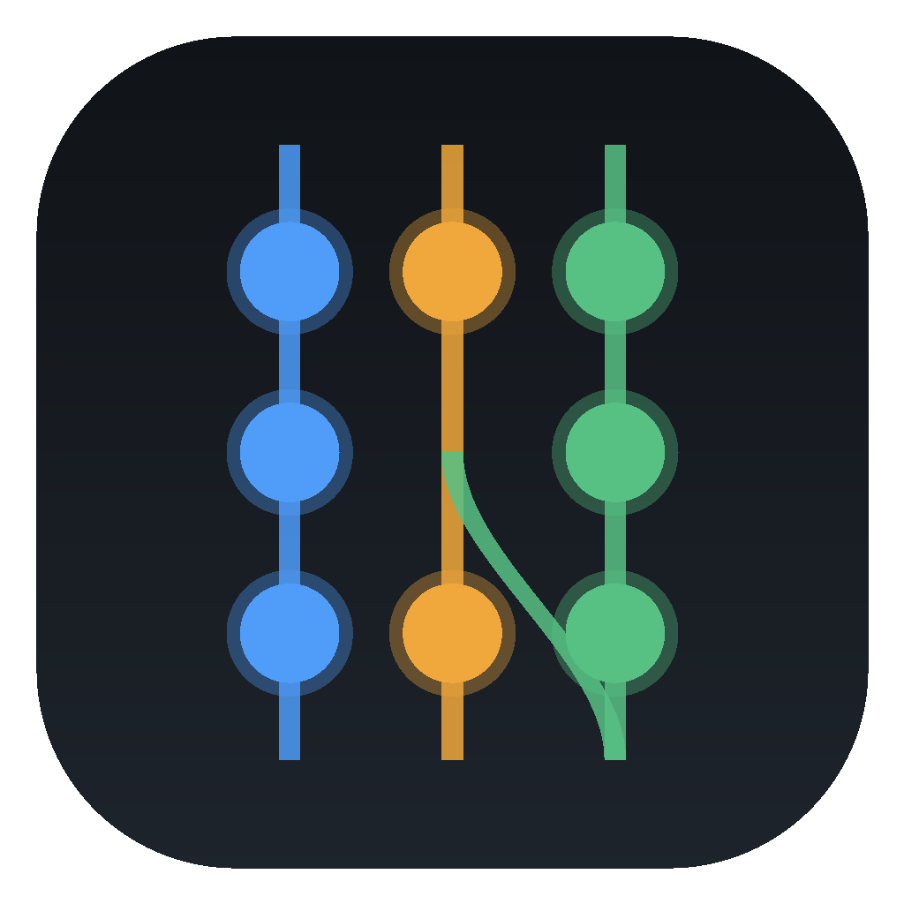
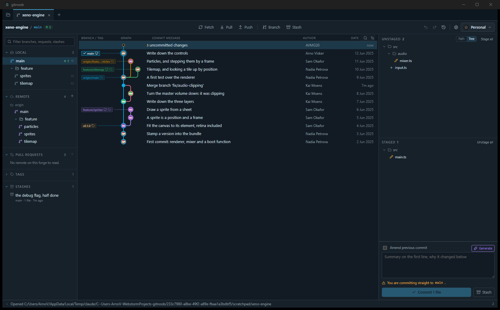
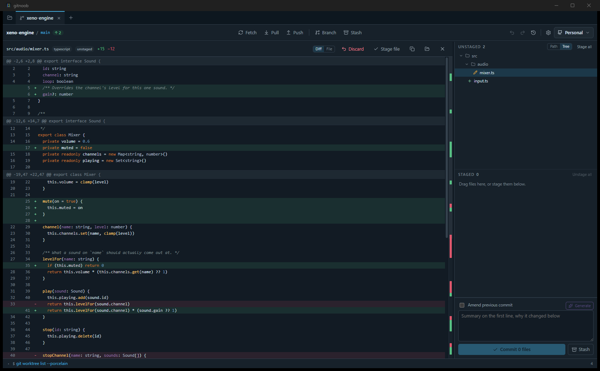
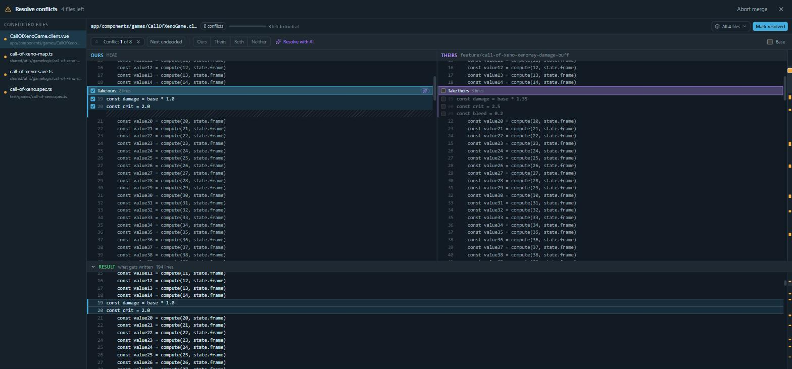
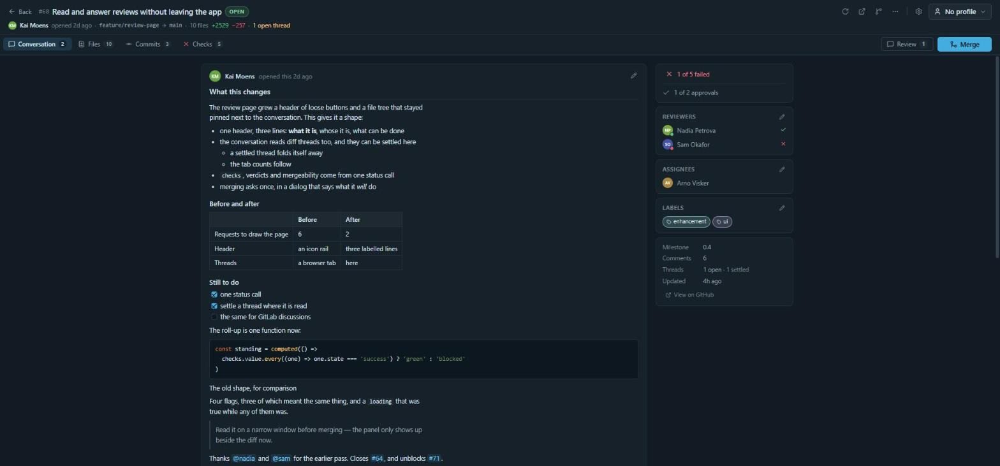
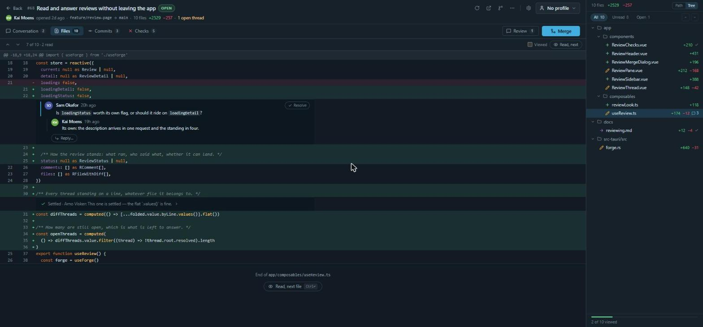

<div align="center">



# gitnoob

**Everything git does, in one click.**

No commands to memorise, no three-step sequences. Point at the thing, pick what
happens to it.

[Download](https://github.com/AVMG20/gitnoob/releases/latest) ·
[Features](#what-you-can-do) ·
[Build it](docs/development.md)



</div>

## Install

Grab your file from [the latest release](https://github.com/AVMG20/gitnoob/releases/latest).

| macOS | Windows | Linux |
|---|---|---|
| `.dmg` (Intel + Apple Silicon) | `.exe` or `.msi` | `.AppImage`, `.deb`, `.rpm` |

Needs `git` on your PATH. Nothing else.

Not code-signed yet, so the first launch needs one click past the warning:
right-click → **Open** on macOS, **More info → Run anyway** on Windows. After
that it updates itself.

## What you can do

**One click, not a command:**

| | |
|---|---|
| Merge, rebase, fast-forward | drag a branch onto another |
| Cherry-pick | drag a commit onto a branch |
| Apply a stash elsewhere | drag the stash onto a branch |
| Stage / unstage | click the file, or one hunk of it |
| Everything else | right-click it |

Also here without typing anything: fetch, pull, push, commit, amend, revert,
reset, tag, stash, branch, worktrees, remotes.



**The repository, drawn.** Commit graph with real lanes and branch chips, smooth
at a hundred thousand commits. Search by message, author or hash. Several repos
open as tabs.

**Conflicts, by checkbox.** Theirs, yours, and the result — tick what you want
from each side. No markers to hand-delete.



**Pull requests in the app.** GitHub and GitLab: the conversation, the checks,
line comments, and one merge button that says what it will do.





**It won't lose your work.** Your changes ride across branch switches. Undo and
redo. Reset shows what goes. Force-push names the commits it would drop, and
always uses `--force-with-lease`.

**Two accounts, no config file.** A profile switches your commit identity, forge
token, SSH key and open tabs together. Tokens live in your OS keychain.

**Optional AI.** With an [OpenRouter](https://openrouter.ai) key: commit messages
from your staged diff, and conflict resolution. No key, nothing sent.

**It teaches, if you want.** Every action prints the git command it ran. Ignore
it, or learn from it.

## Shortcuts

`⌘⇧F` fetch · `⌘⇧L` pull · `⌘⇧P` push · `⌘Enter` commit · `⌘B` branch ·
`⌘⇧S` stash · `⌘F` search · `⌘Z` undo · `⌘,` settings

Full list in Settings → Shortcuts. `Ctrl` on Windows and Linux.

## Good to know

- Your repos stay where they are. No account, no upload, no service.
- Writes run your own `git`, so hooks, signing, SSH agent and credential helpers
  all keep working. Close gitnoob and carry on in a terminal any time.
- Not yet: interactive rebase, line-level staging, blame, submodules, LFS.
  Windows is tested less than macOS and Linux.

## Build it

```sh
npm install
npm run app          # dev
npm run app:build    # a real bundle
```

Details in [`docs/development.md`](docs/development.md).

## License

[GPL-3.0-only](LICENSE). Use it, fork it, sell it — anything you hand on comes
with its source. Nobody gets to close it.
